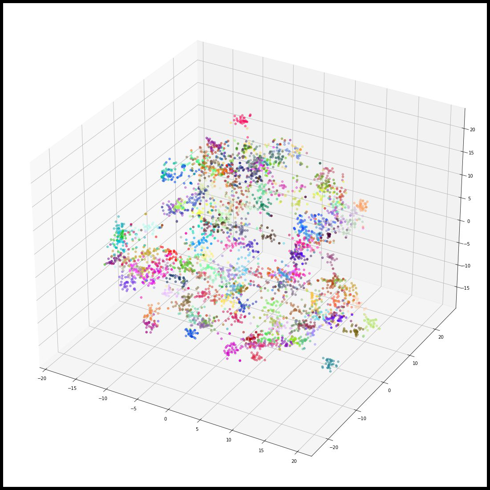
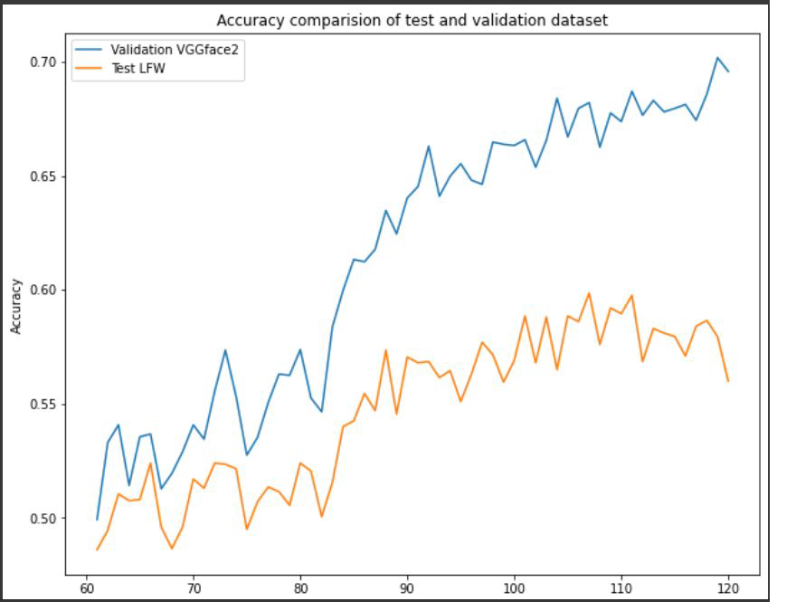
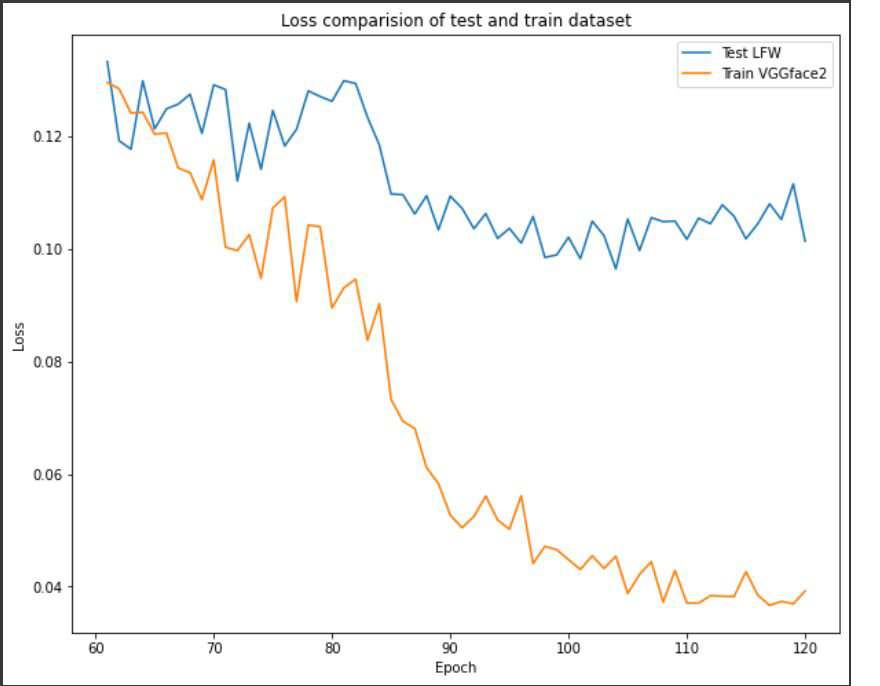
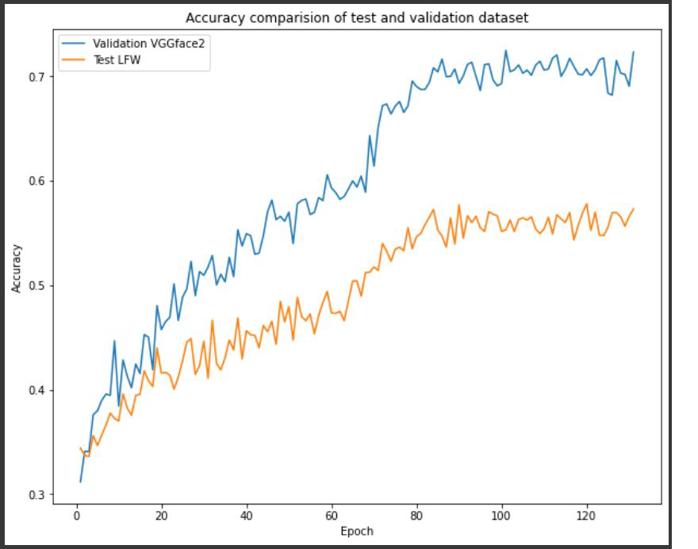
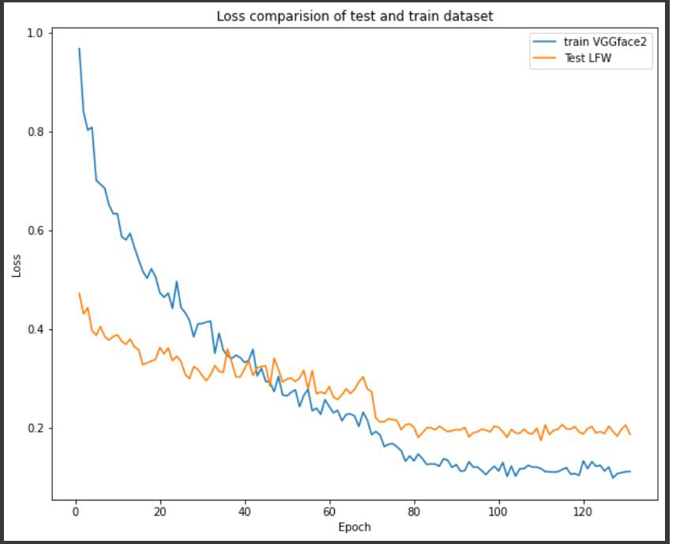

## FaceNet implementation
### Problem satement
In this Project we implemented [Google's FaceNet](https://arxiv.org/abs/1503.03832) , that directly learns a mapping from face images to a compact Euclidean space where distances directly correspond to a measure of face similarity.

### [Presentation](https://docs.google.com/presentation/d/e/2PACX-1vTihbOz33Oyu4n9txbVQfVdXswTRGtKJV3TwjcKYQpHszRszCh3j8XFooEc0wFaiO6WGFzAoh2WACxU/pub?start=false&loop=false&delayms=5000)

### Datasets
- [Training Dataset](https://www.kaggle.com/baohoa/modified-vggface2?select=train_refined_resized)
- [Testing Dataset](http://vis-www.cs.umass.edu/lfw/#deepfunnel-anchor)

### Steps

- Install all datasets and models using

```sh
bash scripts.sh
```


- Start the training script

```
python3 ./Code/train.py
```

- Evaluate Results
```
python3 ./Code/eval_model.py
```


Model will be generated under the name `checkpoint.pth`
### Results
- #### Summary
|             | Margin = 1.7                     | Margin = 1.9                     |
| ----------- | -------------------------------- | -------------------------------- |
| kNN         | 75.5                             | 79.55 (VggFace2)                 |
| Contrastive | 88.23                            | 89.33 (LFW)                      |
| Rank5       | 57.9(LFW) / 70.17 (VggFace2)     | 57.85 (LFW) / 72.33 (VggFace2)   |
| Loss        | 0.1013 (LFW) / 0.0391 (VggFace2) | 0.1867 (LFW) / 0.1111 (VggFace2) |
- #### TSNE Plot of different identities in VGG Face 2 dataset
<p align="center">

</p>

-  ####  RESNET50 RESULTS(MARGIN:0.7)

      - Accuracy: 
      <p align="center">
      
      </p>
    
      - Loss
      <p align="center">
      
      </p>

-  ####  RESNET50 RESULTS(MARGIN: 1.9)

      - Accuracy: 
      <p align="center">
      
      </p>
    
      - Loss
      <p align="center">
      
      </p>


